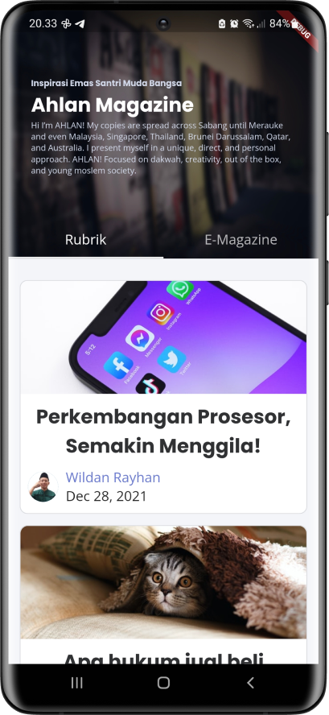
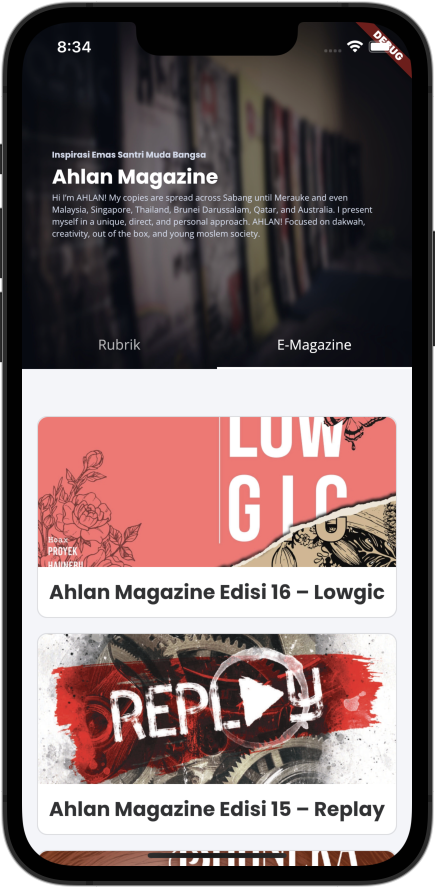

# AhlanMobile

An unofficial [Ahlan Magazine](https://ahlanmagz.com/) mobile app.

This app takes advantage of [Flutter](https://flutter.dev/) and the Ahlan Magazine website itself,
thanks to [WordPress built-in REST API](https://developer.wordpress.org/rest-api/).

	
    

